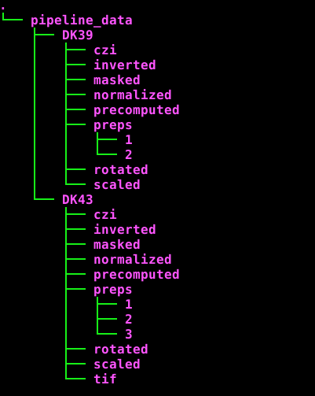

# Pipeline with database integration
This folder is for the model/controller version of the pipeline. This
will be tightly integrated with the database. We are using SqlAlchemy
instead of datajoint as SqlAlchemy is a much more robust and versatile
product. This pipeline will execute in a step by step fashion to
preprocess the slides through to the alignment phase. This will need
to be done outside of the pipeline in a GUI. After alignment is
finished, the remaining steps can be put in this pipeline.

# This version of the pipeline depends on a strict file structure
within the birdstore NFS filesystem. Each animal will have it's own
directory structure. The prep_id will be the name of the parent
directory.

# main.py
The entry point for executing the pipeline. Currently, it is filling
the database with correct data which is used throughout the pipeline.
To execute, go into a virtualenv with the correct libraries and run
python main.py DK43

# models
This folder contains the models/entities that map the database tables
to the python entities. This is a typical ORM (object relational
mapping) design pattern
# controllers
This folder will house the python code to control the models. This is
where the extraction, rotation, scaling, normalizing, et al will be
placed.
